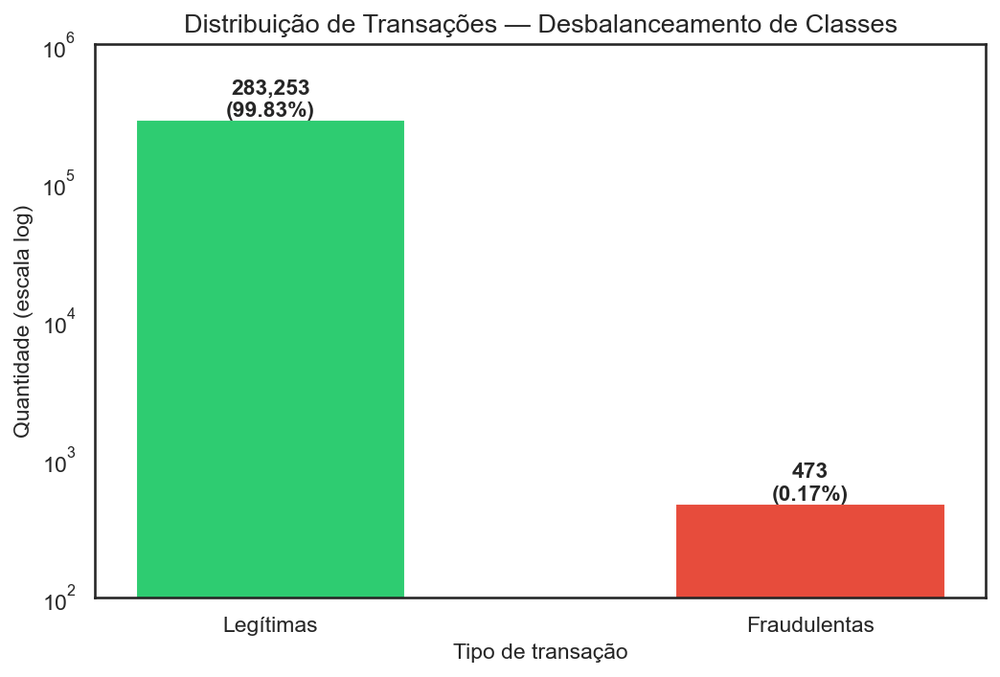
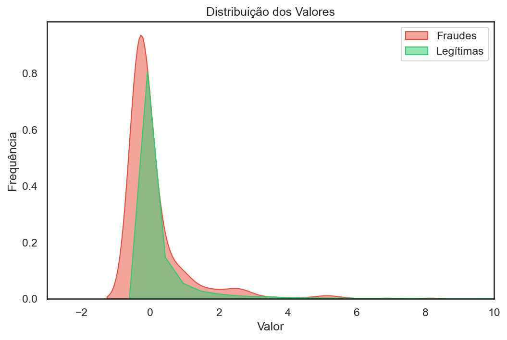
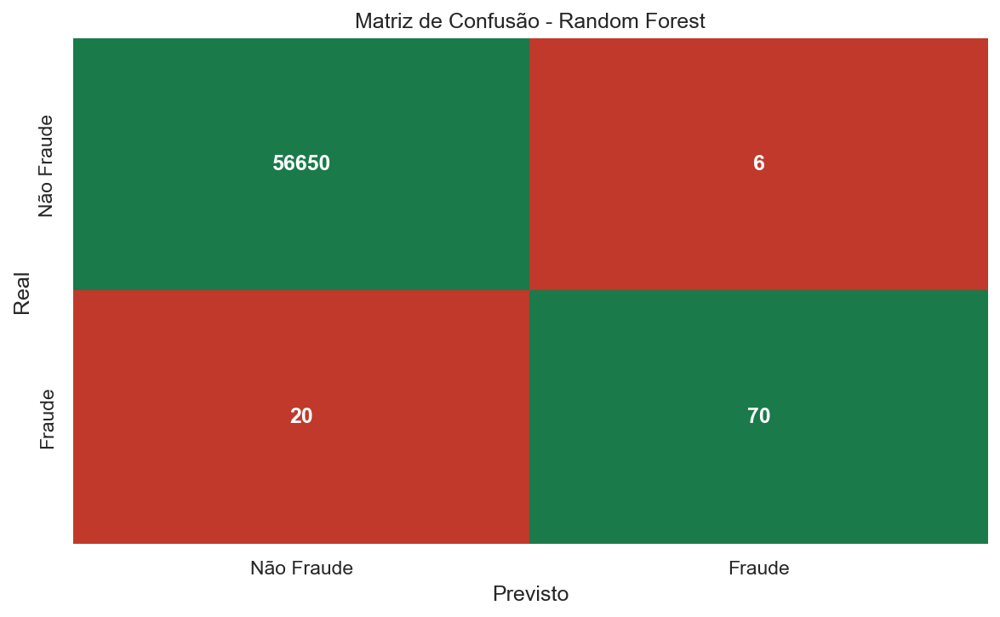
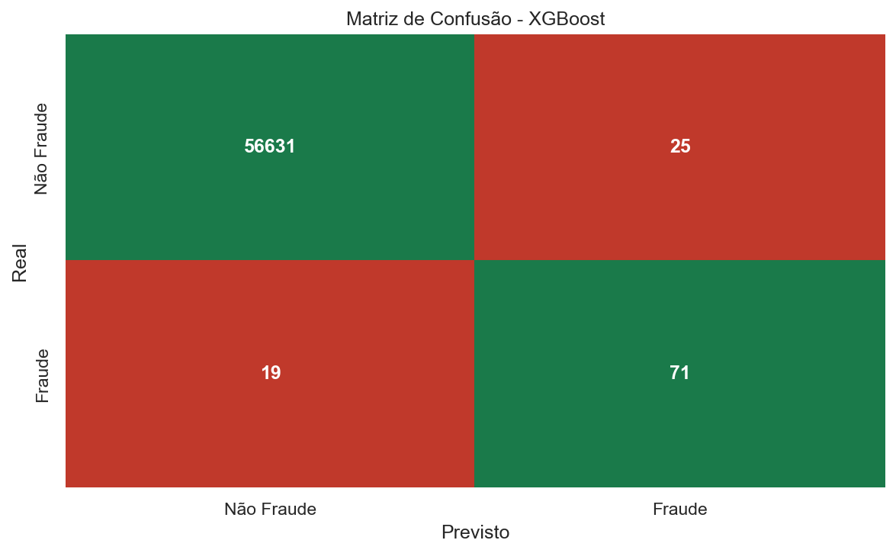

# Detecção de Fraudes em Transações Financeiras
> Aplicação de modelos Random Forest e XGBoost com tratamento de dados desbalanceados — Dataset Kaggle

## Problema de Negócio
Fraudes em cartões de crédito causam prejuízos bilionários ao setor financeiro todo ano. O desafio real é que menos de 0.2% das transações são fraudes reais — o que torna a  detecção automática extremamente difícil para modelos de previsão tradicionais.

Este meu projeto, desenvolvido como parte do meu portfólio no curso de Ciência de Dados, aplica técnicas de Machine Learning para detectar padrões fraudulentos, tratando o desbalanceamento extremo dos dados com SMOTE e comparando dois algoritmos: Random Forest e XGBoost.

## Estrutura do Projeto

```
fraud-detection/
├── data/
│   ├── raw/          # Dados originais do Kaggle
│   └── processed/    # Dados após ETL aplicado (etl.py)
├── notebooks/        # Análise exploratória de dados e avaliação dos resultados dos dois modelos
├── src/              # Scripts Python de ETL e criação do modelo
├── reports/          # Gráficos e resultados gerados a partir da avaliação do conjunto de dados e da execução dos algoritmos
├── requirements.txt  # Bibliotecas utilizadas no projeto
└── README.md
```

## Tecnologias Utilizadas

- **Python 3.13** — linguagem base do projeto
- **Pandas** e **NumPy** — manipulação e transformação de dados (ETL)
- **Matplotlib** e **Seaborn** — visualização de dados, resultados e gráficos
- **Scikit-learn** — divisão de dados, treinamento e avaliação dos modelos
- **XGBoost** — algoritmo de gradient boosting para classificação (Comparar com o modelo Random Forest)
- **Imbalanced-learn (SMOTE)** — tratamento do desbalanceamento de classes (Menos de 0.2% das transações são fraudulentas)
- **Git** — versionamento do código

## Pipeline

1. **Definição do problema** — entendimento do contexto de fraude e métricas relevantes (recall como prioridade)
2. **Estruturação do projeto** — organização de pastas e versionamento com Git
3. **Coleta dos dados** — download do dataset Credit Card Fraud Detection (Kaggle)
4. **ETL** — limpeza de dados, remoção de duplicatas e tratamento de variáveis
5. **EDA** — análise exploratória com visualização do desbalanceamento, distribuição do `Amount` e correlação das variáveis com a classe alvo
6. **Split dos dados** - separação em treino (80%) e teste (20%) com estratificação
7. **Balanceamento** — aplicação do SMOTE apenas no conjunto de treino para tratar o desbalanceamento de 0.17% de fraudes
8. **Treinamento** — criação, treinamento e comparação entre Random Forest e XGBoost
9. **Avaliação** — análise com foco em recall, precision, F1-score e matrizes de confusão
10. **Interpretação** — análise dos erros (FN vs FP) e impacto no negócio

## Resultados

### Distribuição dos dados
O dataset possui 284.807 transações, sendo apenas 473 fraudes — menos de 0.2% do total.
Esse desbalanceamento extremo foi o principal desafio técnico do projeto.



### Distribuição dos Valores das Transações



Ao analisar os dados de valores, observou-se que transações fraudulentas tendem a ter valores menores que as legítimas — a curva vermelha está deslocada para a esquerda em relação à verde. 

Esse comportamento reflete o mundo real: fraudadores preferem valores baixos para evitar bloqueios automáticos e passar despercebidos.

### Comparação dos modelos

Após o balanceamento com SMOTE, treinei e comparei dois modelos focando no **Recall** —
métrica mais importante para detecção de fraudes, pois mede quantas fraudes reais foram detectadas.

| Modelo | Precision | Recall | F1-Score | Fraudes detectadas |
|---|---|---|---|---|
| Random Forest | 0.92 | 0.78 | 0.84 | 70 de 90 |
| XGBoost | 0.74 | 0.79 | 0.76 | 71 de 90 |

#### Matrizes de Confusão



**Random Forest**
- Detectou **70 de 90 fraudes** (Recall: 78%)
- Deixou **20 fraudes passarem** (Falsos Negativos)
- Bloqueou **6 transações legítimas** por engano (Falsos Positivos)
- Precision: 92%
- F1-Score: 0.84 (Maior Equilíbrio)




**XGBoost — Modelo Final**
- Detectou **71 de 90 fraudes** (Recall: 79%)
- Deixou **19 fraudes passarem** (Falsos Negativos)
- Bloqueou **25 transações legítimas** por engano (Falsos Positivos)
- Precision: 74%
- F1-Score: 0.76 

Dependendo do contexto do negócio, cada modelo tem sua particularidade.

A instituição pode preferir bloquear mais transações legítimas do que deixar fraudes passarem, optando por uma abordagem com foco no Recall, onde entende-se que o custo de uma fraude não detectada pode ser maior que o custo de bloquear um cliente legítimo.

Caso a instituição preferisse priorizar a experiência dos clientes, pode optar pelo modelo de Random Forest, com Recall menor em relação ao outro modelo, porém com uma precisão e um equilíbrio melhor no contexto geral.

## Próximos Passos

- [ ] Otimização de hiperparâmetros com `GridSearchCV` para melhorar o Recall
- [ ] Ajuste do threshold de decisão para reduzir Falsos Negativos
- [ ] Implementar curva Precision-Recall para análise mais detalhada do trade-off
- [ ] Testar outros algoritmos como LightGBM e CatBoost


## Como Rodar

### Pré-requisitos
- Python 3.13+
- Git

### Passo a passo

1. Clone o repositório:
```bash
git clone https://github.com/NTzerah/fraud-detection.git
cd fraud-detection
```

2. Crie e ative o ambiente virtual:
```bash
python -m venv venv
venv\Scripts\activate  # Windows
source venv/bin/activate  # Linux/Mac
```

3. Instale as dependências:
```bash
pip install -r requirements.txt
```

4. Baixe o dataset no Kaggle e coloque em `data/raw/`:
- [Credit Card Fraud Detection](https://www.kaggle.com/datasets/mlg-ulb/creditcardfraud)
- Salve o arquivo como `data/raw/creditcard.csv`

5. Execute o ETL:
```bash
python src/etl.py
```

6. Treine os modelos:
```bash
python src/model.py
```

7. Explore os notebooks:
```bash
jupyter notebook
```